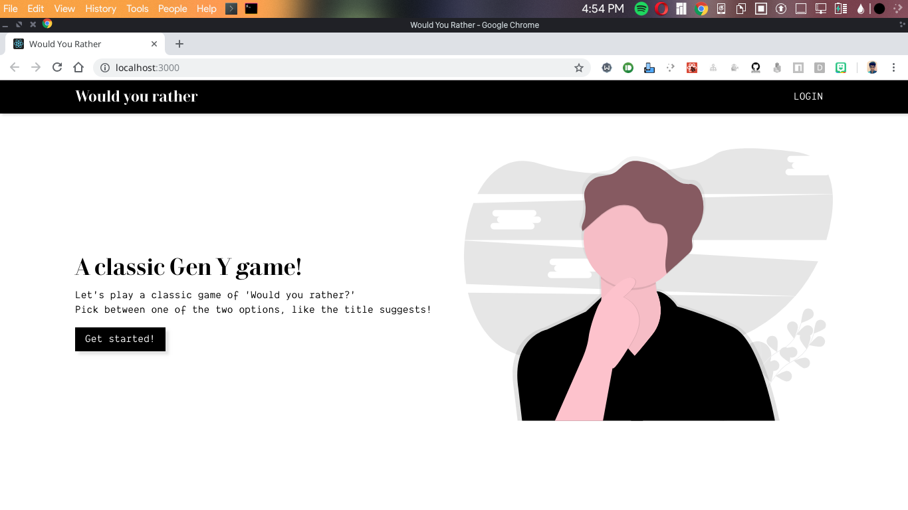
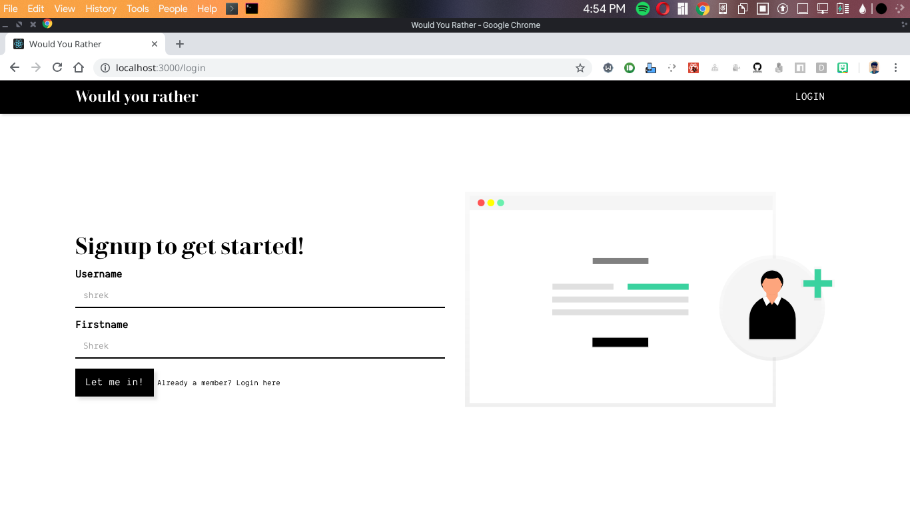
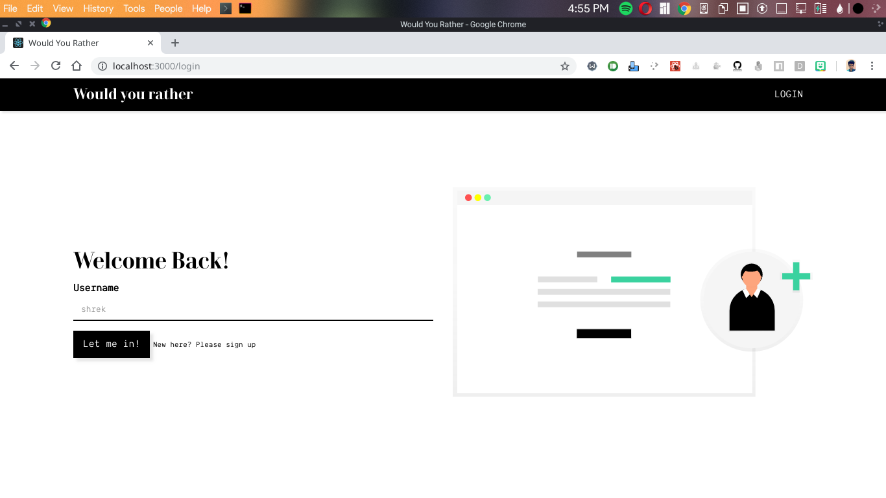
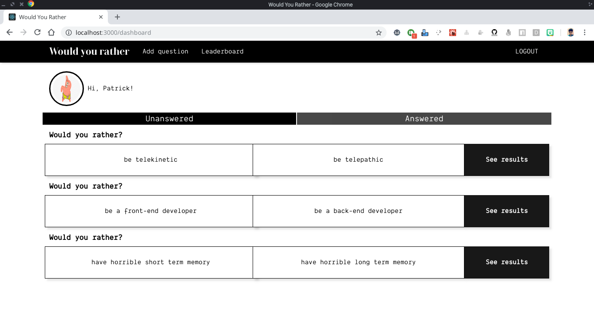
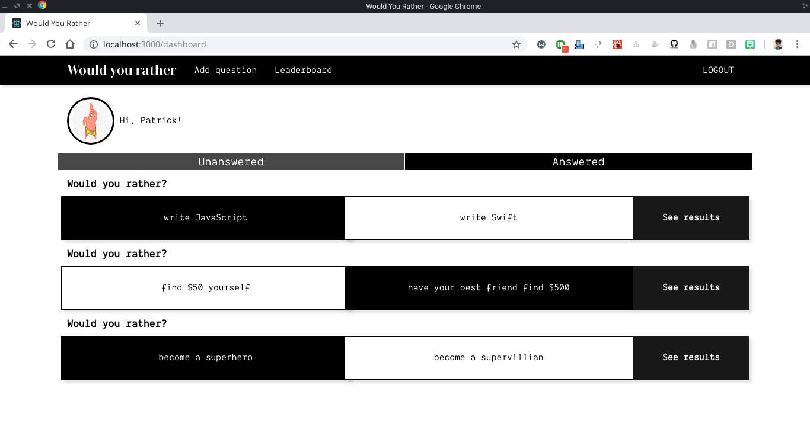
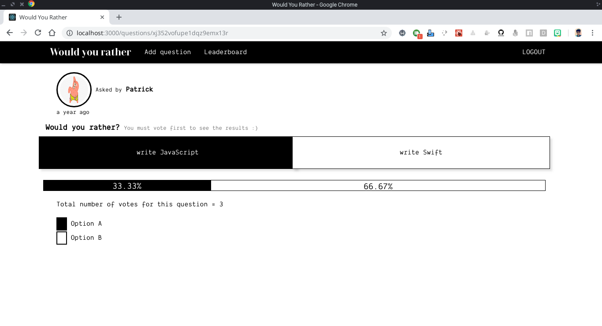
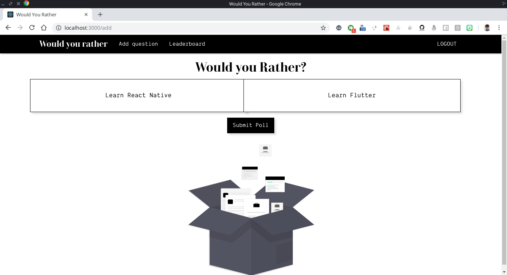
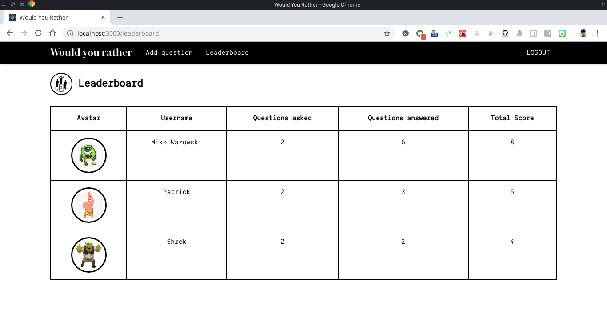

## Would Your Rather

Would you rather is an application built as the second project for the Udacity React Nanodegree.  
This project was built using React/Redux.  

This project is now live at https://wyr.now.sh

### Libraries used

* [ReactJS](https://reactjs.org/)  
* [Redux](https://redux.js.org/)
* [React-Redux](https://redux.js.org/basics/usagewithreact)
* [Create-React-App](https://github.com/facebook/create-react-app)
* [React Router DOM](https://reacttraining.com/react-router/core/guides/philosophy)
* [MomentJS](https://momentjs.com/)
* [Redux-thunk](https://github.com/reduxjs/redux-thunk)
* [Bootstrap 3](https://getbootstrap.com/docs/3.3/components/)

### Installation guide

* **Clone repositories** - `git clone https://github.com/AdithyaBhat17/would-you-rather.git`
* **Install packages** - `npm install`
* **Run development server** - `npm start`
* The application is now up and running at `localhost:3000`

### Snapshots

#### Landing page

#### Authentication

#### Dashboard - Unanswered and Answered questions
 
  

#### Poll results

#### Add question

#### LeaderBoard

